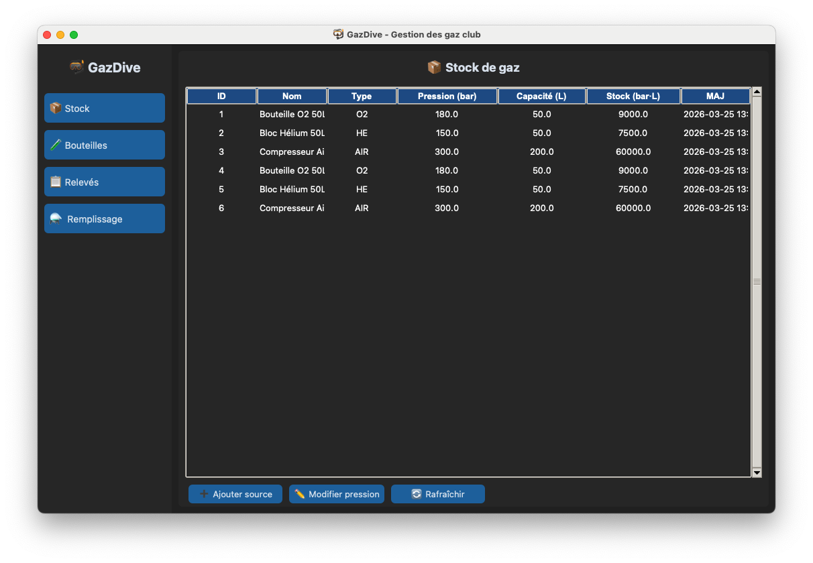

# README.md

```markdown
# 🤿 Gaz Diving Supply — Calculateur de Mélanges de Plongée

Application de gestion et calcul de mélanges de gaz pour la plongée (Nitrox, Trimix, Oxygène).




---

## 📋 Prérequis

- Python 3.10 ou supérieur (3.13 recommandé)
- pip
- Git (optionnel)

---

## 🍎 Installation sur macOS

### 1. Installer Python avec Tkinter (via Homebrew)

```bash
# Installer Homebrew si pas déjà installé
/bin/bash -c "$(curl -fsSL https://raw.githubusercontent.com/Homebrew/install/HEAD/install.sh)"

# Installer Python 3.13 avec Tkinter
brew install python@3.13
brew install python-tk@3.13
```

### 2. Cloner / télécharger le projet

```bash
git clone https://github.com/votre-repo/gaz-diving-supply.git
cd gaz-diving-supply
```

### 3. Créer un environnement virtuel

```bash
python3.13 -m venv venv
source venv/bin/activate
```

### 4. Installer les dépendances

```bash
pip install -r requirements.txt
```

### 5. Lancer l'application

```bash
python main.py
```

---

## 🐧 Installation sur Linux

### 1. Installer Python et Tkinter

**Ubuntu / Debian :**
```bash
sudo apt update
sudo apt install python3 python3-pip python3-tk python3-venv
```

**Fedora / RHEL :**
```bash
sudo dnf install python3 python3-pip python3-tkinter
```

**Arch Linux :**
```bash
sudo pacman -S python python-pip tk
```

### 2. Cloner / télécharger le projet

```bash
git clone https://github.com/votre-repo/gaz-diving-supply.git
cd gaz-diving-supply
```

### 3. Créer un environnement virtuel

```bash
python3 -m venv venv
source venv/bin/activate
```

### 4. Installer les dépendances

```bash
pip install -r requirements.txt
```

### 5. Lancer l'application

```bash
python main.py
```

---

## 🪟 Installation sur Windows

### 1. Installer Python

- Télécharger Python 3.13 sur [python.org](https://www.python.org/downloads/)
- ⚠️ **Cocher "Add Python to PATH"** lors de l'installation
- Tkinter est inclus automatiquement sur Windows ✅

### 2. Télécharger le projet

```bash
git clone https://github.com/votre-repo/gaz-diving-supply.git
cd gaz-diving-supply
```

Ou télécharger le ZIP depuis GitHub et extraire.

### 3. Créer un environnement virtuel

```cmd
python -m venv venv
venv\Scripts\activate
```

### 4. Installer les dépendances

```cmd
pip install -r requirements.txt
```

### 5. Lancer l'application

```cmd
python main.py
```

---

## 📁 Structure du projet

```
gaz-diving-supply/
├── main.py              # Point d'entrée de l'application
├── calcul_gaz.py        # Logique de calcul des mélanges
├── database.py          # Gestion base de données SQLite
├── ui_components.py     # Composants de l'interface
├── requirements.txt     # Dépendances Python
└── README.md            # Ce fichier
```

---

## 🚀 Fonctionnalités

- Calcul de mélanges Nitrox, Trimix et Oxygène pur
- Gestion de l'inventaire des bouteilles
- Historique des remplissages
- Interface graphique moderne (CustomTkinter)
- Base de données locale SQLite

---

## 🐛 Problèmes connus

### Tkinter non trouvé (macOS)
```bash
brew install python-tk@3.13
```

### Module non trouvé
Vérifier que l'environnement virtuel est bien activé :
```bash
source venv/bin/activate   # macOS / Linux
venv\Scripts\activate      # Windows
```

---

## 📄 Licence

MIT License — Libre d'utilisation et de modification.
```


# Packager en exécutable

## Outil recommandé : PyInstaller

```bash
# Installer PyInstaller (venv activé)
pip install pyinstaller
```

---

## 🍎 macOS — Créer un .app

```bash
pyinstaller --windowed --onefile --name "GazDivingSupply" main.py
```

- `--windowed` : pas de terminal en arrière-plan
- `--onefile` : tout dans un seul fichier
- `--name` : nom de l'exécutable

L'exécutable sera dans `dist/GazDivingSupply.app`

---

## 🐧 Linux — Créer un binaire

```bash
pyinstaller --onefile --name "GazDivingSupply" main.py
```

L'exécutable sera dans `dist/GazDivingSupply`

---

## 🪟 Windows — Créer un .exe

```cmd
pyinstaller --windowed --onefile --name "GazDivingSupply" main.py
```

L'exécutable sera dans `dist\GazDivingSupply.exe`

---

## ⚠️ Problèmes fréquents avec CustomTkinter

CustomTkinter nécessite ses assets (images, thèmes). Utiliser `--collect-all` :

```bash
pyinstaller --windowed --onefile \
  --collect-all customtkinter \
  --name "GazDivingSupply" \
  main.py
```

---

## 📦 Avec un fichier .spec (recommandé)

Créer `GazDivingSupply.spec` pour plus de contrôle :

```bash
# Générer le .spec
pyinstaller --windowed --collect-all customtkinter --name "GazDivingSupply" main.py

# Modifier le .spec si besoin, puis recompiler
pyinstaller GazDivingSupply.spec
```

---

## 🗂️ Structure après build

```
gaz-diving-supply/
├── dist/
│   └── GazDivingSupply     # ← Exécutable à distribuer
├── build/                  # Fichiers temporaires (ignorable)
├── GazDivingSupply.spec    # Config PyInstaller
└── ...
```

---

## 💡 Ajouter une icône

```bash
# macOS
pyinstaller --windowed --onefile \
  --collect-all customtkinter \
  --icon=icon.icns \
  --name "GazDivingSupply" main.py

# Windows
pyinstaller --windowed --onefile \
  --collect-all customtkinter \
  --icon=icon.ico \
  --name "GazDivingSupply" main.py
```

> ⚠️ **Important** : L'exécutable doit être compilé **sur le même OS** que la machine cible. Un `.app` macOS ne fonctionnera pas sur Windows et vice-versa.
